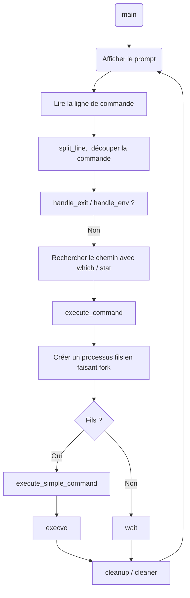

# Simple Shell


(merci à Kévin pour ces magnifiques boutons ! ✨)

---
## ✨ Description

Ce projet réalise un interpréteur de commandes UNIX basique, aussi appelé "shell". Il exécute les commandes en ligne de commande comme /bin/ls ou pwd, et gère des fonctionnalités simples comme la recherche dans le PATH, la gestion des processus, ou la prise en charge des erreurs.

Ce projet réplique partiellement le comportement du shell Bourne (sh), dans une version simplifiée. Il permet de mieux comprendre comment un shell fonctionne à bas niveau. C'est un projet pédagogique visant à comprendre les mécanismes internes d'un shell UNIX : parsing, gestion des processus, mémoire, entrée/sortie, etc.

---
## ✅ Requirements

Éditeurs autorisés : `vi, vim, emacs`

Compilation sur Ubuntu 20.04 LTS avec :

`gcc -Wall -Werror -Wextra -pedantic -std=gnu89`

Tous les fichiers doivent se terminer par une nouvelle ligne

Un fichier `README.md` est obligatoire à la racine du projet

Le code doit respecter le style Betty (utiliser `betty-style.pl` et `betty-doc.pl`)

Aucune fuite mémoire n'est tolérée

Maximum 5 fonctions par fichier

Tous les fichiers d'en-tête doivent être protégés par des include guards

Utilisation des appels système uniquement si nécessaire (réfléchir à leur usage)

Un seul dépôt par groupe pour GitHub. Cloner ou forker un dépôt avec le même nom avant la deuxième deadline peut entraîner une note de 0%

## ℹ️ Plus d'infos

L'affichage doit correspondre exactement à celui de `/bin/sh` (sortie standard et erreurs)

La seule différence permise : le nom du programme dans les messages d’erreur doit correspondre à `argv[0]`

---
## 🔧 Compilation

Pour compiler le shell :
```bash
gcc -Wall -Werror -Wextra -pedantic -std=gnu89 *.c -o hsh
```

---
## 🚀 Utilisation

Une fois compilé, vous pouvez lancer le shell avec :
```bash
./hsh
```
Il accepte des commandes UNIX standards en mode interactif :
```bash
$ ./hsh
$ ls -l /tmp
$ pwd
$ exit
```
```bash
$ ls -l /tmp
total 24
drwx------ 2 root   root   4096 Apr 24 20:42 snap-private-tmp
drwx------ 3 root   root   4096 Apr 24 20:42 systemd-private-2c72b27ff54a46a38e22cd144cdea8ed-systemd-logind.service-ChLY5B
drwx------ 3 root   root   4096 Apr 24 20:42 systemd-private-2c72b27ff54a46a38e22cd144cdea8ed-systemd-resolved.service-c8eKen
drwx------ 3 root   root   4096 Apr 24 20:42 systemd-private-2c72b27ff54a46a38e22cd144cdea8ed-systemd-timesyncd.service-8QDOQL
drwx------ 3 root   root   4096 Apr 24 20:42 systemd-private-2c72b27ff54a46a38e22cd144cdea8ed-wsl-pro.service-hIOEwM
drwxr-xr-x 2 samira samira 4096 Apr 24 20:42 {C670DEAF-4282-4A6C-82AF-8CFA590D2404}
```

Il fonctionne aussi en mode non interactif :
```bash
echo "/bin/ls" | ./hsh
```
```bash
$ samira@Samira:~/holbertonschool-simple_shell$ echo "/bin/ls" | ./hsh
AUTHORS  README.md  _which.c  clean.c  execute.c  hsh  main.c  main.h  split_line.c
```
---
## 📊 Valgrind

Pour vérifier qu'il n'y a pas de fuite mémoire :
```bash
valgrind ./hsh
```
Aucune fuite ne doit être détectée !
```bash
==29855== Memcheck, a memory error detector
==29855== Copyright (C) 2002-2022, and GNU GPL'd, by Julian Seward et al.
==29855== Using Valgrind-3.22.0 and LibVEX; rerun with -h for copyright info
==29855== Command: ./hsh
==29855==
$ ==29855==
==29855== HEAP SUMMARY:
==29855==     in use at exit: 0 bytes in 0 blocks
==29855==   total heap usage: 2 allocs, 2 frees, 1,144 bytes allocated
==29855==
==29855== All heap blocks were freed -- no leaks are possible
==29855==
==29855== For lists of detected and suppressed errors, rerun with: -s
==29855== ERROR SUMMARY: 0 errors from 0 contexts (suppressed: 0 from 0)
```
---
📚 Man Page 📚
Vous pouvez consulter la man page de la fonction _printf en exécutant la commande suivante :
```bash
man ./man_1_simple_shell
```

## 🔄 Flowchart (Diagramme de fonctionnement)



---
## 👥 Auteurs

Projet réalisé dans le cadre du programme Holberton School.

- 👨‍💻 : **Castan Claire** – [GitHub](https://github.com/Helvlaska)
- 👨‍💻 : **Roche Samira** – [GitHub](https://github.com/StrawberSam)

