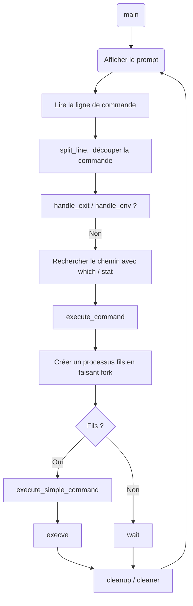

# Simple Shell


(merci à Kévin pour ces magnifiques boutons ! ✨)

---
## ✨ Description

Ce projet réalise un interpréteur de commandes UNIX basique, aussi appelé "shell". Il exécute les commandes en ligne de commande comme /bin/ls ou pwd, et gère des fonctionnalités simples comme la recherche dans le PATH, la gestion des processus, ou la prise en charge des erreurs.

Ce projet réplique partiellement le comportement du shell Bourne (sh), dans une version simplifiée. Il permet de mieux comprendre comment un shell fonctionne à bas niveau.

---
## 🔧 Compilation

Pour compiler le shell :
```bash
gcc -Wall -Werror -Wextra -pedantic *.c -o hsh
```

---
## 🚀 Utilisation

Une fois compilé, vous pouvez lancer le shell avec :
```bash
./hsh
```
Il accepte des commandes UNIX standards en mode interactif :
```bash
$ ./hsh
$ ls -l /tmp
$ pwd
$ exit
```
Il fonctionne aussi en mode non interactif :
```bash
echo "/bin/ls" | ./hsh
```
---
## 📊 Valgrind

Pour vérifier qu'il n'y a pas de fuite mémoire :
```bash
valgrind ./hsh
```
Aucune fuite ne doit être détectée !

---
## 🔄 Flowchart (Diagramme de fonctionnement)



---
## 👥 Auteurs

Projet réalisé dans le cadre du programme Holberton School.

- 👨‍💻 : **Castan Claire** – [GitHub](https://github.com/Helvlaska)
- 👨‍💻 : **Roche Samira** – [GitHub](https://github.com/StrawberSam)

Ce shell est un projet pédagogique visant à comprendre les mécanismes internes d'un shell UNIX : parsing, gestion des processus, mémoire, entrée/sortie, etc.
